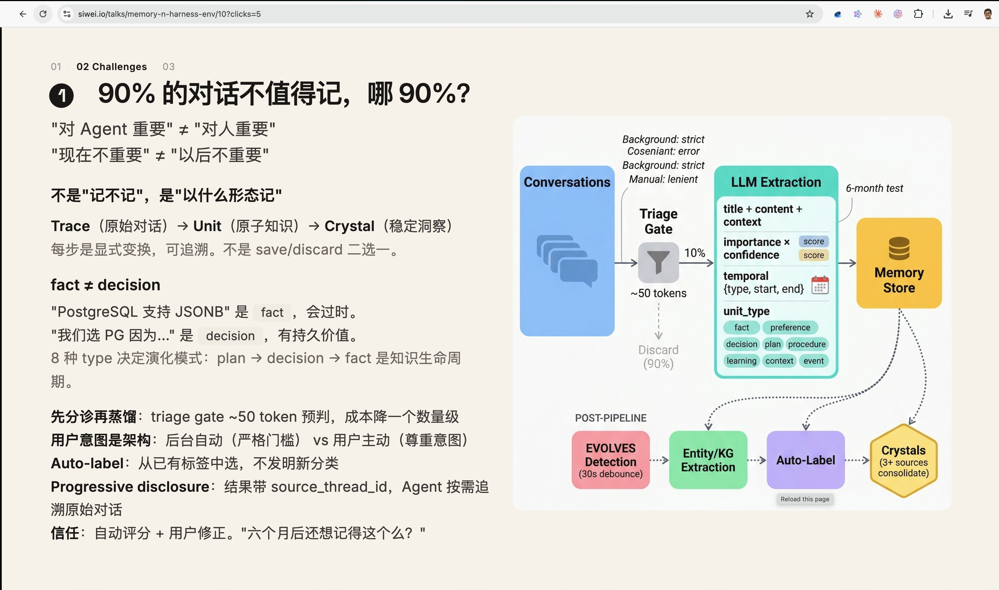

# Memory triage / crystal model lessons

Status: design note, not a PRD/build contract.
Date: 2026-06-11

This note preserves a useful external memory-pipeline idea for possible future
Engram ingestion work. It should be read as adapter/ingestion inspiration, not
as a replacement for Engram's core model in [PRD.md](../PRD.md) or
[agentic-knowledge-core.html](agentic-knowledge-core.html).

## What the slide is saying

The slide's center of gravity is conversation memory:

- Most conversation turns are not worth promoting into durable memory.
- The real question is not "save or discard?", but "what form should this be
  remembered in?"
- Raw conversation traces can be transformed into smaller units, then later into
  stable "crystals".
- A cheap triage gate can cut cost before a heavier LLM extraction pass.
- Extracted units carry title/content/context, importance, confidence, temporal
  scope, and a unit type such as fact, preference, decision, plan, procedure,
  learning, context, or event.
- Later pipeline steps can add entity/KG extraction, labels, evolution detection,
  and consolidation from multiple sources.
- Drill-back matters: each result should retain a source thread pointer.

That is a good product/UX framing for agent memory. Engram's framing is stricter:
the durable unit is a claim with forced provenance, calibrated confidence, typed
relations, append-only lineage, and governance.

## What Engram can learn

### 1. Add a cheap source triage layer before expensive distillation

Engram already has `source -> claim -> page/view`, with Distiller doing the
semantic work. A conversation-heavy source stream may need a pre-Distiller
triage layer so the system does not spend full extraction cost on every turn.

Possible shape:

- Input: `source.kind = conversation_log` or an external thread locator.
- Output: `source_triage` event, not a claim.
- Fields: `decision = keep | defer | ignore`, `reason`, `estimatedUtility`,
  `topic`, `sourceThreadId`, `turnRange`, `triageModel`, `triageVersion`.
- Constraint: triage can schedule or deprioritize Distiller work, but cannot
  directly create active claims or affect truth confidence.

Important boundary: "discard 90%" must not mean silently destroying evidence.
If full raw retention is too expensive, retain at least a locator/hash/reason so
later audits can explain why the source was not distilled.

### 2. Treat Trace -> Unit -> Crystal as UI vocabulary, not core primitives

This maps roughly to Engram, but should not replace Engram terms:

- Trace ~= raw `source`
- Unit ~= draft `claim` candidate or extracted memory unit
- Crystal ~= active/high-confidence claim cluster or page-level presentation

"Crystal" could become a Studio badge or view filter for "stable, repeatedly
supported, recently verified claims". It should not become a new storage layer
unless it can be expressed as claim status, confidence snapshot, independent
supports, and relations.

### 3. Separate importance from truth

The slide combines `importance x confidence`. Engram should not do that for
trust. In Engram:

- `confidence` answers: "how likely is this claim to be correct?"
- `importance` answers: "is this worth spending attention or tokens on?"

Importance is useful for triage, review priority, summarization, and UI ranking.
It should not be multiplied into calibrated confidence, because an important but
uncertain claim must remain uncertain.

### 4. Use unit types as adapter facets, not kernel ontology

The slide's unit types are useful: fact, preference, decision, plan, procedure,
learning, context, event.

Engram core should still stay domain neutral and only depend on
`source/claim/relation/provenance/confidence`. Unit type can live in one of
these places:

- `source.meta` for conversation ingestion hints.
- adapter-specific metadata for recall/rerank behavior.
- Studio filters for review and browsing.
- evaluation labels for conversation-memory golden sets.

The rule should be: useful as a facet, dangerous as a hard kernel taxonomy.

### 5. Make temporal extraction first-class for conversational sources

The slide explicitly captures temporal scope. Engram already has `asOf` and
staleness/decay concepts; conversation ingestion should preserve more temporal
shape when available:

- `observedAt`: when the statement appeared.
- `validFrom` / `validUntil`: when the claim is meant to hold.
- `decisionAt`: when a decision was made.
- `expiresAt`: when a plan/preference should be rechecked.

This is especially important for preferences and plans, where old memory can be
worse than no memory.

### 6. Drill-back should be part of the user experience

The slide's `source_thread_id` is directly compatible with Engram provenance.
For conversation sources, provenance locators should be precise enough to open:

- thread id
- message id or turn range
- speaker/actor
- timestamp
- excerpt or span hash

This enables progressive disclosure: recall can show the claim first, then let
the consuming agent or editor jump back to the original conversation only when
needed.

### 7. "Auto-label from existing labels" is a good governance rule

The slide says auto-label should choose from existing labels rather than invent
new categories. That matches Engram's preference for controlled adapter
semantics:

- Labels can help browsing and review.
- Label creation should be editor/adapter governed.
- LLMs can assign labels, but should not silently expand the ontology.

### 8. Six-month usefulness is a good memory-quality question

"Will this still be useful in six months?" is a good retention heuristic, but it
is not a truth signal.

Engram can translate this into product metrics:

- Was the claim recalled in later tasks?
- Did later `report_usage` mark it adopted, corrected, or refuted?
- Did it prevent a repeat user question?
- Did it become stale and need revalidation?

This belongs in usage/utility evaluation, not in calibrated truth confidence.

## What Engram should not copy directly

- Do not physically discard source evidence just because a first-pass gate says
  it is low value.
- Do not merge importance and truth confidence into one trust score.
- Do not treat "3+ sources" as sufficient for "crystal"; supports must be
  independent, provenance-backed, and contradiction-aware.
- Do not let LLM extraction write directly to active memory. New claims should
  start as draft and pass Engram's consumption gates.
- Do not move fact/preference/decision/plan/procedure into the kernel unless a
  later PRD explicitly changes the domain-neutral boundary.

## Possible future implementation slice

If Engram later ingests agent conversations, the smallest useful slice is:

1. Add a `conversation_log` source reader that preserves thread/message
   locators.
2. Add a non-authoritative triage event/table before Distiller.
3. Add a conversation-memory L1 golden set:
   - triage precision/recall for "worth distilling"
   - locator precision
   - no active claim without exact provenance
   - no false confidence boost from importance
4. Let Distiller consume only `keep` and selected `defer` items.
5. Render a Studio drill-back view for remembered conversation claims.

This keeps the good part of the slide: cost-aware memory formation and
progressive disclosure. It avoids weakening Engram's core: claim-level
provenance, calibrated confidence, append-only lineage, and human-governed
relaxation.

## Bottom line

Adopt this as a conversation-source ingestion pattern. Do not adopt it as the
Engram kernel.
